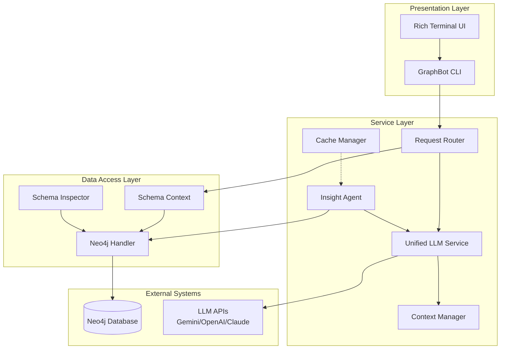

# Neo4j GraphBot — Current State Document

> **Auto-generated snapshot of project health, architecture, and progress.**

---

## 1. Project Metadata

| **Field** | **Value** |
|-----------|-----------|
| **Project Name** | `neo4j-graphbot` (v1.0.0) |
| **Team Members** | Rafiul Haider (Lead Developer, UID: U0200293), Ali Khan, Yogesh |
| **Last Update** | Sunday, December 7, 2025 |
| **Academic Context** | CS 673 — Scalable Databases (Fall 2025) @ Pace University |
| **License** | MIT |

### Tech Stack

| **Category** | **Technologies** |
|--------------|------------------|
| **Language** | Python 3.8+ |
| **Database** | Neo4j (Graph Database) via `neo4j>=5.15.0` |
| **LLM Integration** | Google Gemini (`google-generativeai>=0.3.2`), OpenAI (Stub), Anthropic (Stub) |
| **CLI Framework** | Rich (`rich>=13.7.0`) for terminal UI |
| **Configuration** | `python-dotenv>=1.0.0`, `PyYAML>=6.0` |
| **Containerization** | Docker, docker-compose |
| **Testing** | pytest, pytest-cov |
| **Code Quality** | Black, Flake8, MyPy |

---

## 2. Directory Structure

```text
neo4jsinteract/
├── config/                          # ⚙️ Configuration files
│   ├── config.env                   # Environment variables (user secrets)
│   ├── config.env.template          # Template for environment setup
│   └── providers.yaml               # LLM provider profiles & prompts
│
├── docs/                            # 📚 Documentation
│   ├── architecture.md              # System design & Mermaid diagrams
│   ├── api-reference.md             # Code documentation
│   ├── deployment.md                # Production deployment guide
│   ├── setup-guide.md               # Installation instructions
│   ├── QUICKSTART.md                # Quick start guide
│   └── README_DOCKER.md             # Docker-specific docs
│
├── scripts/                         # 🛠️ Utility scripts
│   ├── control_panel.py             # AI Control Panel (profile switching)
│   ├── debug_connection.py          # Connection debugging
│   ├── explore_database.py          # Database exploration tool
│   ├── explore_database_simple.py   # Simplified DB explorer
│   ├── migrate_cache.py             # Cache migration utility
│   └── test_connection.py           # Connection testing
│
├── src/graphbot/                    # 🧠 Core Application Source
│   ├── __init__.py
│   ├── cli.py                       # Entry point for CLI
│   ├── graphbot.py                  # Main orchestrator (586 LOC)
│   │
│   ├── core/                        # Core logic
│   │   ├── schema_context.py        # Schema context for query generation
│   │   └── test_schema_context.py   # Unit tests
│   │
│   ├── handlers/                    # Data Access Layer
│   │   ├── neo4j_handler.py         # Neo4j connection & query execution
│   │   └── test_neo4j_handler.py    # Unit tests
│   │
│   ├── services/                    # Service Layer (Business Logic)
│   │   ├── cache_manager.py         # Thread-safe cache with LRU eviction
│   │   ├── context_manager.py       # Token counting & prompt truncation
│   │   ├── gemini_service.py        # Legacy Gemini-specific service
│   │   ├── insight_agent.py         # Background DB mapping agent
│   │   ├── llm.py                   # LLM Factory & Provider abstractions
│   │   ├── schema_inspector.py      # Property value sampling
│   │   ├── unified_llm_service.py   # Multi-provider LLM facade
│   │   └── test_*.py                # Unit tests for services
│   │
│   └── utils/                       # Helpers
│       ├── query_builder.py         # Query validation & sanitization
│       └── test_query_builder.py    # Unit tests
│
├── tests/                           # 🧪 Integration & Stress Tests
│   ├── integration/
│   │   ├── test_agent_flow.py       # Agent orchestration tests
│   │   ├── test_edge_cases.py       # Edge case handling
│   │   └── test_unified_flow.py     # Insight → Schema → Query flow
│   └── stress/
│       └── stress_schema_mapping.py # Performance stress tests
│
├── Dockerfile                       # Container definition
├── docker-compose.yml               # Multi-container setup
├── Makefile                         # Build automation
├── pyproject.toml                   # Package configuration
├── requirements.txt                 # Core dependencies
├── run.sh                           # Docker convenience script
└── README.md                        # Project overview
```

---

## 3. Implementation Status (Rubric Check)

### ✅ Data Cleansing
| **Status** | **Evidence** |
|------------|--------------|
| ✅ **Implemented** | `QueryBuilder.sanitize_query()` in `src/graphbot/utils/query_builder.py` removes comments, normalizes whitespace, and auto-injects `LIMIT` for safety. |

**Key Code:**
```python
# src/graphbot/utils/query_builder.py:53-91
def sanitize_query(query: str) -> str:
    # Remove single-line comments
    # Clean up multiple spaces
    # Auto-inject LIMIT if not present in RETURN queries
```

---

### ✅ Data Transformation (ETL)
| **Status** | **Evidence** |
|------------|--------------|
| ✅ **Implemented** | `InsightAgent._extract_raw_schema_async()` transforms raw Neo4j metadata into structured schema representations. `ContextManager.prepare_prompt()` transforms/truncates context data to fit token limits. |

**Key Components:**
- **Schema Extraction:** `src/graphbot/services/insight_agent.py` (Lines 102-163)
- **Context Windowing:** `src/graphbot/services/context_manager.py` (Lines 36-124)
- **Result Transformation:** `Neo4jHandler.format_results()` converts Neo4j Node/Relationship objects to serializable dictionaries.

---

### ✅ Graph Modeling (Nodes & Relationships)

The application dynamically discovers and works with **any** Neo4j graph schema. The system introspects the database to extract:

| **Element** | **Discovery Method** |
|-------------|----------------------|
| **Node Labels** | `CALL db.labels() YIELD label` |
| **Relationship Types** | `CALL db.relationshipTypes() YIELD relationshipType` |
| **Properties** | `RETURN keys(n)` sampling |
| **Cardinality** | `RETURN count(n)` aggregation |

**Schema Context Output Example:**
```markdown
## Node Labels
- **User**: 1,500 nodes. Properties: id, name, email
- **Product**: 350 nodes. Properties: sku, title, price

## Relationships
- **PURCHASED**: 5,200 connections.
- **REVIEWED**: 1,800 connections.
```

**Cypher Queries Generated (Examples from Codebase):**
```cypher
-- Schema introspection
MATCH (n) RETURN DISTINCT labels(n) as labels LIMIT 100
MATCH ()-[r]->() RETURN DISTINCT type(r) as type LIMIT 100
MATCH (a)-[r:`PURCHASED`]->(b) RETURN DISTINCT labels(a)[0], labels(b)[0] LIMIT 5

-- User queries (generated via LLM)
MATCH (u:User)-[:BOUGHT]->(p:Product {name: 'X'}) RETURN u
MATCH (n:Person {name: 'Alice'})-[:KNOWS]->(m:Person) RETURN n, m
```

---

### ✅ Visualization / Querying Features

| **Feature** | **Status** | **Location** |
|-------------|------------|--------------|
| Natural Language → Cypher | ✅ Implemented | `UnifiedLLMService.generate_cypher_query_async()` |
| Query Validation | ✅ Implemented | `QueryBuilder.validate_query()` — detects DROP, DETACH DELETE, Cartesian products |
| Write Operation Confirmation | ✅ Implemented | `graphbot.py:295-300` — prompts user before mutations |
| Rich Table Output | ✅ Implemented | `Neo4jHandler.format_results()` — renders results in Rich tables |
| Result Explanation | ✅ Implemented | `UnifiedLLMService.explain_result_async()` — LLM-generated insights |
| Interactive Schema Inspection | ✅ Implemented | `SchemaInspector.interactive_check()` |
| Background DB Mapping | ✅ Implemented | `InsightAgent.analyze_database_async()` |
| Multi-Provider LLM Support | ✅ Implemented | `LLMFactory` supports Gemini, OpenAI (stub), Anthropic (stub) |
| Cache Management | ✅ Implemented | `CacheManager` with LRU eviction, TTL expiration |
| Control Panel | ✅ Implemented | `scripts/control_panel.py` — profile switching, connection testing |

**Not Yet Implemented:**
| **Feature** | **Status** |
|-------------|------------|
| Shortest Path Algorithm UI | ❌ Not found |
| Community Detection | ❌ Not found |
| Graph Visualization (visual rendering) | ❌ Not found (text-based only) |

---

## 4. Code Health & Stats

### File Statistics

| **Metric** | **Count** |
|------------|-----------|
| **Total Files (tracked)** | ~53 files (`.py`, `.yaml`, `.md`, `.sh`, `.toml`, `.txt`) |
| **Python Source Files** | 28 files |
| **Lines of Python Code** | ~5,451 LOC |
| **Test Files** | 11 files (`test_*.py`) |
| **Documentation Files** | 7 Markdown files |

### Largest Files (Complexity Hotspots)

| **File** | **LOC** | **Notes** |
|----------|---------|-----------|
| `graphbot.py` | 586 | Main orchestrator — could benefit from splitting command handlers |
| `gemini_service.py` | 410 | Legacy service — mostly superseded by `unified_llm_service.py` |
| `neo4j_handler.py` | 340 | Well-structured, async-first design |
| `cache_manager.py` | 320 | Thread-safe, feature-complete |
| `llm.py` | 314 | Clean abstraction with robust error handling |
| `insight_agent.py` | 264 | Background agent with retry logic |

### Known Issues & Technical Debt

| **Type** | **Location** | **Description** |
|----------|--------------|-----------------|
| ⚠️ Debug statement | `gemini_service.py:210` | `# Build debug info for error message` — leftover debug comment |
| ⚠️ Debug logging | `schema_context.py:140` | `logger.debug(f"Count query failed: {e}")` — may mask errors |
| ⚠️ Stub implementations | `llm.py:261-284` | `OpenAIProvider` and `AnthropicProvider` are stubs returning mock data |
| ⚠️ Hardcoded path | `graphbot.py:394` | Control panel path is hardcoded: `neo4jsinteract/scripts/control_panel.py` |
| ⚠️ Legacy code | `gemini_service.py` | Entire file is superseded by `unified_llm_service.py` but kept for compatibility |

### Code Quality Observations

| **Aspect** | **Assessment** |
|------------|----------------|
| **Async Architecture** | ✅ Excellent — consistent `async/await` patterns throughout |
| **Error Handling** | ✅ Good — custom exception hierarchy (`LLMError`, `LLMRateLimitError`, etc.) |
| **Retry Logic** | ✅ Good — exponential backoff in LLM calls and DB queries |
| **Type Hints** | ✅ Good — most functions have type annotations |
| **Test Coverage** | ⚠️ Moderate — unit tests exist but integration coverage could improve |
| **Documentation** | ✅ Good — docstrings present, architecture docs available |

---

## 5. Setup & Run Instructions (Current State)

### Prerequisites

- Python 3.8+
- Neo4j Database (local or AuraDB)
- Google Gemini API Key (or other LLM provider)

### Quick Start (Local)

```bash
# 1. Clone the repository
git clone https://github.com/yourusername/neo4j-graphbot.git
cd neo4j-graphbot

# 2. Create and activate virtual environment
python3 -m venv venv
source venv/bin/activate  # Windows: venv\Scripts\activate

# 3. Install dependencies
pip install -e .[dev]

# 4. Configure environment
cp config/config.env.template config/config.env
# Edit config/config.env with your credentials:
#   NEO4J_URI=neo4j://localhost:7687
#   NEO4J_USER=neo4j
#   NEO4J_PASSWORD=your_password
#   NEO4J_DATABASE=neo4j
#   GEMINI_API_KEY=your_api_key

# 5. Launch GraphBot CLI
graphbot
```

### Docker Deployment

```bash
# Option 1: Using run.sh (recommended)
./run.sh

# Option 2: Manual Docker commands
docker build -t neo4j-graphbot .
docker run -it --rm \
    --network host \
    -v "$(pwd)/config/config.env:/app/config/config.env:ro" \
    neo4j-graphbot
```

### Available Commands (In CLI)

| **Command** | **Description** |
|-------------|-----------------|
| `<natural language>` | Ask questions about your graph in plain English |
| `schema` | View discovered database schema |
| `inspect` | Interactive property value inspection |
| `model` | Switch AI model |
| `panel` | Open Control Panel for LLM profile management |
| `connect` | Connect to a different database |
| `use <db>` | Switch to a different database |
| `cache` | Cache management (stats, list, clear, cleanup) |
| `clear` | Clear screen |
| `help` | Show help |
| `quit` / `exit` | Exit application |

### Running Tests

```bash
# Run all tests
pytest

# Run with coverage
pytest --cov=graphbot --cov-report=html

# Run specific test file
pytest tests/integration/test_unified_flow.py -v
```

---

## 6. Architecture Summary



---

## 7. Next Steps / Recommendations

1. **Complete LLM Provider Stubs:** Implement actual OpenAI and Anthropic providers in `llm.py`.
2. **Remove Legacy Code:** Deprecate `gemini_service.py` once all usages migrate to `unified_llm_service.py`.
3. **Add Graph Visualization:** Integrate a library like `pyvis` or `networkx` for visual graph rendering.
4. **Implement Graph Algorithms:** Add shortest path, PageRank, or community detection features.
5. **Improve Test Coverage:** Add more integration tests for edge cases and error scenarios.
6. **CI/CD Pipeline:** Set up GitHub Actions for automated testing and linting.

---

*Document generated: Sunday, December 7, 2025*

