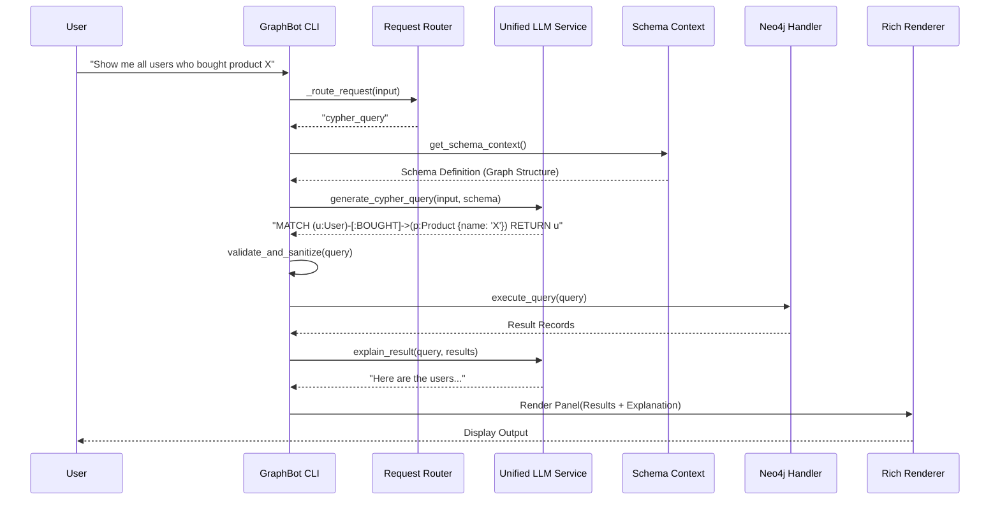

# System Architecture

## Overview

Neo4j GraphBot is a modular CLI application designed to bridge the gap between natural language and Neo4j graph databases. It leverages Large Language Models (LLMs) to translate user intent into precise Cypher queries, executes them against the database, and interprets the results.

## High-Level Design

The system follows a layered architecture:

1.  **Presentation Layer (CLI)**: Handles user input, rendering rich text UI, and command routing.
2.  **Service Layer**: Encapsulates core business logic (LLM interaction, Schema Analysis, Caching).
3.  **Data Access Layer**: Manages direct interactions with Neo4j and local configuration/cache storage.

## Component Interaction

The following sequence diagram illustrates the flow of a standard user query:

## Core Components

### 1. GraphBot (Controller)
*   **Location**: `src/graphbot/graphbot.py`
*   **Responsibility**: Orchestrates the application lifecycle, initializes services, and manages the main event loop. It uses `rich` to render the UI.

### 2. Unified LLM Service
*   **Location**: `src/graphbot/services/unified_llm_service.py`
*   **Responsibility**: Abstracts LLM provider interactions. It manages prompt construction, context windowing, and switches between models (e.g., Gemini, OpenAI).

### 3. Neo4j Handler
*   **Location**: `src/graphbot/handlers/neo4j_handler.py`
*   **Responsibility**: Manages the Bolt connection to the Neo4j instance. Handles query execution, transaction management, and connection pooling.

### 4. Insight Agent
*   **Location**: `src/graphbot/services/insight_agent.py`
*   **Responsibility**: Runs in the background to analyze the database structure. It extracts node labels, relationship types, and samples property values to build a semantic understanding of the graph.

### 5. Schema Context & Cache
*   **Location**: `src/graphbot/core/schema_context.py` & `src/graphbot/services/cache_manager.py`
*   **Responsibility**: Maintains an up-to-date representation of the database schema to feed into the LLM, ensuring accurate query generation.

## Data Flow

1.  **Initialization**: On startup, `InsightAgent` scans the DB (if connected) and caches the schema.
2.  **Query Generation**: User input is combined with the cached schema. The `UnifiedLLMService` sends this prompt to the configured Provider.
3.  **Execution**: The returned Cypher is validated (checking for destructive operations) and executed via `Neo4jHandler`.
4.  **Interpretation**: Raw DB results are sent back to the LLM for summarization before being presented to the user.

